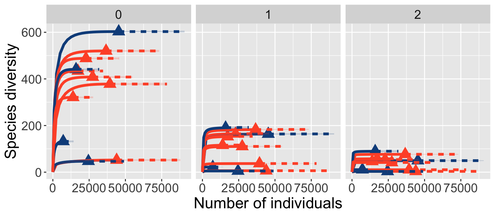
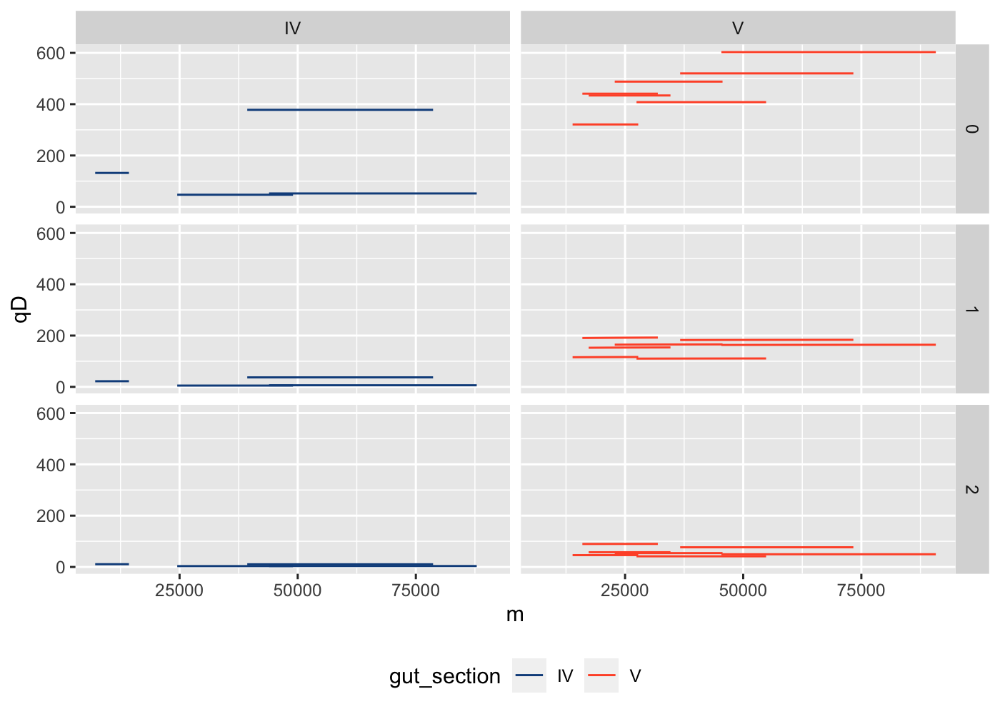
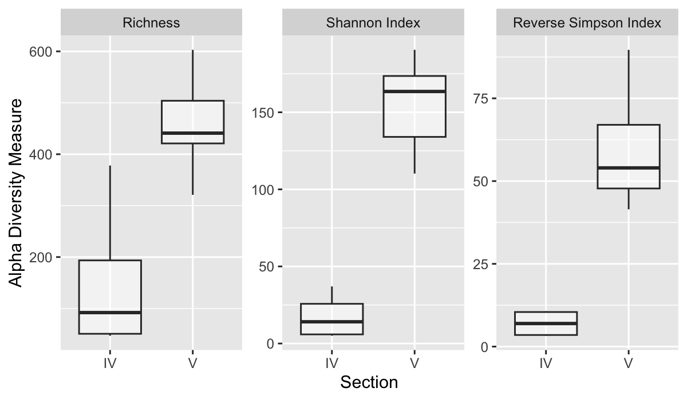

```r
knitr::opts_chunk$set(echo = TRUE,
                      fig.align = "center",
                      fig.path = "../figures/04_Biodiversity/",
                      dev = "png", dpi = 200) 

# send any figure output to this folder 
```

# Setting the Environment 

### Set my seed

```r
# Any number can be chose
set.seed(567890)
```

## Load Libraries 

```r
pacman::p_load(tidyverse, devtools, patchwork, iNEXT, phyloseq,
               install = FALSE)
```

## Load in Data 

```r
load("data/02_PreProcessing/raw_preprocessed_physeq.RData")
raw_preprocessed_physeq
```

```
## phyloseq-class experiment-level object
## otu_table()   OTU Table:         [ 6015 taxa and 12 samples ]
## sample_data() Sample Data:       [ 12 samples by 23 sample variables ]
## tax_table()   Taxonomy Table:    [ 6015 taxa by 9 taxonomic ranks ]
```

```r
# Intuition Check 
min(sample_sums(raw_preprocessed_physeq))
```

```
## [1] 7089
```

```r
# Setting colors for gut sections 
gutsection_colors <- c(
  "IV" = "dodgerblue4",
  "V" = "#FF5733")

# Make metadata dataframe
metadata_df <-
  raw_preprocessed_physeq %>%
  sample_data() %>%
  data.frame()
```


# Goals

1. Calculate the Hill Diversity of the samples. 
2. Evaluate the rarefaction curves. 
3. Evaluate the Diversity values. 
4. Makes notes of specific samples and their seq depth. 

# Diversity Calculations with iNEXT 


```r
# prepare input data 
iNEXT_input_df <- 
  raw_preprocessed_physeq %>%
  otu_table() %>%
  data.frame()
# Quick check
dim(iNEXT_input_df)
```

```
## [1] 6015   12
```

```r
# Run iNEXT: Calculate the Hill Numbers 
# Note that: Species in ROWS, Samples in COLUMNS 
# Remember to set the seed! 
#iNEXT_data <- iNEXT(iNEXT_input_df, 
 #                   q = c(0,1,2), datatype = "abundance")

# Save the file
#save(iNEXT_data, file = "data/04_Biodiversity/iNEXT_data.RData")
```

# Evaluate the Diversity! 

```r
load("data/04_Biodiversity/iNEXT_data.RData")
str(iNEXT_data)
```

```
## List of 3
##  $ DataInfo:'data.frame':	12 obs. of  14 variables:
##   ..$ Assemblage: chr [1:12] "X568_4" "X568_5" "X581_5" "X611_5" ...
##   ..$ n         : num [1:12] 24503 17303 15963 13893 7131 ...
##   ..$ S.obs     : num [1:12] 47 434 441 321 261 603 52 408 378 520 ...
##   ..$ SC        : num [1:12] 1 1 1 1 1 1 1 1 1 1 ...
##   ..$ f1        : num [1:12] 0 0 0 0 0 0 0 0 0 0 ...
##   ..$ f2        : num [1:12] 4 10 5 8 11 5 8 10 15 8 ...
##   ..$ f3        : num [1:12] 5 15 15 7 12 9 3 9 19 11 ...
##   ..$ f4        : num [1:12] 0 23 18 13 19 20 4 10 15 12 ...
##   ..$ f5        : num [1:12] 2 18 27 19 18 18 0 17 18 17 ...
##   ..$ f6        : num [1:12] 4 24 21 19 16 16 2 17 16 14 ...
##   ..$ f7        : num [1:12] 1 24 20 13 13 19 0 15 11 22 ...
##   ..$ f8        : num [1:12] 0 17 12 9 9 15 2 16 16 15 ...
##   ..$ f9        : num [1:12] 0 16 19 15 14 15 0 9 13 11 ...
##   ..$ f10       : num [1:12] 2 13 18 7 6 15 0 14 11 11 ...
##  $ iNextEst:List of 2
##   ..$ size_based    :'data.frame':	1440 obs. of  10 variables:
##   .. ..$ Assemblage: chr [1:1440] "X568_4" "X568_4" "X568_4" "X568_4" ...
##   .. ..$ m         : num [1:1440] 1 1362 2723 4084 5445 ...
##   .. ..$ Method    : chr [1:1440] "Rarefaction" "Rarefaction" "Rarefaction" "Rarefaction" ...
##   .. ..$ Order.q   : num [1:1440] 0 0 0 0 0 0 0 0 0 0 ...
##   .. ..$ qD        : num [1:1440] 1 29.7 35.1 38.2 40.3 ...
##   .. ..$ qD.LCL    : num [1:1440] 1 28.7 33.8 36.7 38.7 ...
##   .. ..$ qD.UCL    : num [1:1440] 1 30.6 36.3 39.6 41.8 ...
##   .. ..$ SC        : num [1:1440] 0.304 0.994 0.997 0.998 0.999 ...
##   .. ..$ SC.LCL    : num [1:1440] 0.3 0.994 0.997 0.998 0.999 ...
##   .. ..$ SC.UCL    : num [1:1440] 0.309 0.995 0.997 0.998 0.999 ...
##   ..$ coverage_based:'data.frame':	684 obs. of  8 variables:
##   .. ..$ Assemblage: chr [1:684] "X568_4" "X568_4" "X568_4" "X568_4" ...
##   .. ..$ SC        : num [1:684] 0.304 0.994 0.997 0.998 0.999 ...
##   .. ..$ m         : num [1:684] 1 1362 2723 4084 5445 ...
##   .. ..$ Method    : chr [1:684] "Rarefaction" "Rarefaction" "Rarefaction" "Rarefaction" ...
##   .. ..$ Order.q   : num [1:684] 0 0 0 0 0 0 0 0 0 0 ...
##   .. ..$ qD        : num [1:684] 1 29.7 35.1 38.2 40.3 ...
##   .. ..$ qD.LCL    : num [1:684] 0.994 28.243 33.305 36.3 38.39 ...
##   .. ..$ qD.UCL    : num [1:684] 1.01 31.13 36.84 40.04 42.17 ...
##  $ AsyEst  :'data.frame':	36 obs. of  7 variables:
##   ..$ Assemblage: chr [1:36] "E03_5" "E03_5" "E03_5" "E05_5" ...
##   ..$ Diversity : chr [1:36] "Species richness" "Shannon diversity" "Simpson diversity" "Species richness" ...
##   ..$ Observed  : num [1:36] 261 109.9 50.8 603 163.5 ...
##   ..$ Estimator : num [1:36] 261 112 51.2 603 164.6 ...
##   ..$ s.e.      : num [1:36] 3.4 1.55 1.25 2.86 1.28 ...
##   ..$ LCL       : num [1:36] 261 109 48.7 603 162.1 ...
##   ..$ UCL       : num [1:36] 267.7 115.1 53.6 608.6 167.1 ...
##  - attr(*, "class")= chr "iNEXT"
```

```r
typeof(iNEXT_data)
```

```
## [1] "list"
```

# Plot Diversity 

```r
# Prepare Colors 
color_df <- 
  iNEXT_input_df %>%
  colnames() %>%
  data.frame()
# Check
head(color_df)
```

```
##        .
## 1 X568_4
## 2 X568_5
## 3 X581_5
## 4 X611_5
## 5  E03_5
## 6  E05_5
```

```r
# Rename the column 
colnames(color_df)[1] <- "names"
# Check
head(color_df)
```

```
##    names
## 1 X568_4
## 2 X568_5
## 3 X581_5
## 4 X611_5
## 5  E03_5
## 6  E05_5
```

```r
# Make a helper dataframe for plotting with colors 
iNEXT_color_df <- 
  color_df %>%
  # Fix the names for merging
  mutate(names = gsub(names, pattern = "[.]", replace = "-"),
         names = gsub(names, pattern = "X",  replace = "")) %>%
  # Merge with metadata
  left_join(metadata_df, by = "names") %>%
   #Merge with colors for plotting with ggiNEXT
  left_join(y=data.frame(gutsection_colors = gutsection_colors,
            gut_section = names(gutsection_colors)),
            by = "gut_section")
```

# Plot Rarefaction with `ggiNEXT`


```r
# Plot rarefaction! 
# rarefaction/extrapolation curve, type = 1 

# Order q: 
  # 0 = Richness/ Number of Total taxa
  # 1 = Exponential Shannon / Number of "Common" taxa
  # 2 = Inverse Simpson / Number of "Dominant" taxa 

ggiNEXT(iNEXT_data, type = 1, facet.var = "Order.q") + 
  facet_wrap(~Order.q, scales = "fixed") + 
  scale_color_manual(values = iNEXT_color_df$gutsection_colors, guide = FALSE) + 
  scale_fill_manual(values = iNEXT_color_df$gutsection_colors, guide = FALSE) + 
  scale_shape_manual(values = base::rep(17, nsamples(raw_preprocessed_physeq)),
                     guide = FALSE) + 
  theme(legend.position = "none")
```

```
## Scale for colour is already present.
## Adding another scale for colour, which will replace the existing scale.
## Scale for fill is already present.
## Adding another scale for fill, which will replace the existing scale.
```




My rarefaction curves and extrapolation looks like I would expect. Species diversity decreases as the hill numbers increase, which makes sense since the higher hill numbers represent taking into account more abundant samples. The range of species diversity is greater between my samples when I don't take into account the abundance of my samples.

# Manually plot Diversity 

## Rarefaction

```r
iNEXT_manual_df <- 
  iNEXT_data$iNextEst$size_based %>%
  dplyr::rename(names = Assemblage) %>%
  # Fix the samples names 
  mutate(names = gsub(names, pattern = "[.]", replace = "-"),
         names = gsub(names, pattern = "X", replace = "")) %>%
  # join with metadata 
  left_join(., metadata_df, by = "names") %>%
  # Add colors to data frame
  left_join(., data.frame(gutsection_colors = gutsection_colors,
                          gut_section = names(gutsection_colors)),
            by = "gut_section") 

# Inspect 
dim(iNEXT_manual_df)
```

```
## [1] 1440   33
```

```r
str(iNEXT_manual_df)
```

```
## 'data.frame':	1440 obs. of  33 variables:
##  $ names              : chr  "568_4" "568_4" "568_4" "568_4" ...
##  $ m                  : num  1 1362 2723 4084 5445 ...
##  $ Method             : chr  "Rarefaction" "Rarefaction" "Rarefaction" "Rarefaction" ...
##  $ Order.q            : num  0 0 0 0 0 0 0 0 0 0 ...
##  $ qD                 : num  1 29.7 35.1 38.2 40.3 ...
##  $ qD.LCL             : num  1 28.7 33.8 36.7 38.7 ...
##  $ qD.UCL             : num  1 30.6 36.3 39.6 41.8 ...
##  $ SC                 : num  0.304 0.994 0.997 0.998 0.999 ...
##  $ SC.LCL             : num  0.3 0.994 0.997 0.998 0.999 ...
##  $ SC.UCL             : num  0.309 0.995 0.997 0.998 0.999 ...
##  $ host_species       : chr  "Pomacanthus sexstriatus" "Pomacanthus sexstriatus" "Pomacanthus sexstriatus" "Pomacanthus sexstriatus" ...
##  $ gut_section        : chr  "IV" "IV" "IV" "IV" ...
##  $ region             : chr  "Great Barrier Reef" "Great Barrier Reef" "Great Barrier Reef" "Great Barrier Reef" ...
##  $ location           : chr  "South Island South" "South Island South" "South Island South" "South Island South" ...
##  $ year               : int  2014 2014 2014 2014 2014 2014 2014 2014 2014 2014 ...
##  $ month              : int  12 12 12 12 12 12 12 12 12 12 ...
##  $ day                : int  12 12 12 12 12 12 12 12 12 12 ...
##  $ sample_lab         : chr  "S246" "S246" "S246" "S246" ...
##  $ Time               : chr  "15:30" "15:30" "15:30" "15:30" ...
##  $ SL..mm.            : int  236 236 236 236 236 236 236 236 236 236 ...
##  $ FL..mm.            : int  285 285 285 285 285 285 285 285 285 285 ...
##  $ TW..g.             : num  654 654 654 654 654 ...
##  $ GW..g.             : num  52.5 52.5 52.5 52.5 52.5 52.5 52.5 52.5 52.5 52.5 ...
##  $ Sex                : chr  "M" "M" "M" "M" ...
##  $ Sample_or_Control  : chr  "Sample" "Sample" "Sample" "Sample" ...
##  $ input              : num  52502 52502 52502 52502 52502 ...
##  $ filtered           : num  25983 25983 25983 25983 25983 ...
##  $ denoisedF          : num  25713 25713 25713 25713 25713 ...
##  $ denoisedR          : num  25724 25724 25724 25724 25724 ...
##  $ merged             : num  24787 24787 24787 24787 24787 ...
##  $ nochim             : num  24522 24522 24522 24522 24522 ...
##  $ perc_reads_retained: num  46.7 46.7 46.7 46.7 46.7 ...
##  $ gutsection_colors  : chr  "dodgerblue4" "dodgerblue4" "dodgerblue4" "dodgerblue4" ...
```

```r
# Plot it - Rarefaction Curve 
iNEXT_manual_df %>%
  # Filter out rows that are calcaulted by rarefaction from iNEXT
  dplyr::filter(Method == "Extrapolation") %>%
  # Make the actual rarefaction plot with 
  # the # of sequences on the x-axis and diversity on the y-axis
  # You can choose to pick one diversity value or plot all three 
  ggplot(aes(x = m, y= qD, color = gut_section, group = names)) + 
  # line 
  geom_line() + 
  #geom_point() + 
  # Challenge: Facet with gut section
  facet_grid(Order.q~gut_section, scales = "fixed") + 
  scale_color_manual(values = gutsection_colors) + 
  theme(legend.position = "bottom")
```




# Diversity vs Gut Section 


```r
iNEXT_manual_df %>%
  dplyr::filter(Method == "Observed") %>%
  ggplot(aes(x = gut_section, y = qD)) + 
  facet_wrap(.~Order.q, scales = "free") + 
  geom_point(aes(color = gut_section)) + 
  stat_smooth() + 
  labs(x = "Gut section", y = "# of ASVs") + 
  scale_color_manual(values = gutsection_colors) + 
  theme(legend.position = "bottom")
```

```
## `geom_smooth()` using method = 'loess' and formula = 'y ~ x'
```



This plot compares the relative number of ASVs to gut section (IV or V). Consistantly, gut section V has a higher amount of ASVs. This could be random, however it contradicts what we previously thought about the data. Our previous assumption was that gut section V was less diverse than gut section IV. I'm not sure how to parse this with gut section V having more ASVs. I thought that the number of ASVs was due to the illumina run but all the samples were run at the same time, to my knowledge.


# Session Information 

```r
# Ensure reproducibility 
devtools::session_info()
```

```
## ─ Session info ───────────────────────────────────────────────────────────────
##  setting  value
##  version  R version 4.3.2 (2023-10-31)
##  os       Rocky Linux 9.0 (Blue Onyx)
##  system   x86_64, linux-gnu
##  ui       X11
##  language (EN)
##  collate  en_US.UTF-8
##  ctype    en_US.UTF-8
##  tz       America/New_York
##  date     2024-04-29
##  pandoc   3.1.1 @ /usr/lib/rstudio-server/bin/quarto/bin/tools/ (via rmarkdown)
## 
## ─ Packages ───────────────────────────────────────────────────────────────────
##  package          * version    date (UTC) lib source
##  ade4               1.7-22     2023-02-06 [1] CRAN (R 4.3.2)
##  ape                5.8        2024-04-11 [1] CRAN (R 4.3.2)
##  Biobase            2.62.0     2023-10-24 [2] Bioconductor
##  BiocGenerics       0.48.1     2023-11-01 [2] Bioconductor
##  biomformat         1.30.0     2023-10-24 [1] Bioconductor
##  Biostrings         2.70.1     2023-10-25 [2] Bioconductor
##  bitops             1.0-7      2021-04-24 [2] CRAN (R 4.3.2)
##  bslib              0.5.1      2023-08-11 [2] CRAN (R 4.3.2)
##  cachem             1.0.8      2023-05-01 [2] CRAN (R 4.3.2)
##  callr              3.7.3      2022-11-02 [2] CRAN (R 4.3.2)
##  cli                3.6.1      2023-03-23 [2] CRAN (R 4.3.2)
##  cluster            2.1.4      2022-08-22 [2] CRAN (R 4.3.2)
##  codetools          0.2-19     2023-02-01 [2] CRAN (R 4.3.2)
##  colorspace         2.1-0      2023-01-23 [2] CRAN (R 4.3.2)
##  crayon             1.5.2      2022-09-29 [2] CRAN (R 4.3.2)
##  data.table         1.14.8     2023-02-17 [2] CRAN (R 4.3.2)
##  devtools         * 2.4.4      2022-07-20 [2] CRAN (R 4.2.1)
##  digest             0.6.33     2023-07-07 [2] CRAN (R 4.3.2)
##  dplyr            * 1.1.3      2023-09-03 [2] CRAN (R 4.3.2)
##  ellipsis           0.3.2      2021-04-29 [2] CRAN (R 4.3.2)
##  evaluate           0.23       2023-11-01 [2] CRAN (R 4.3.2)
##  fansi              1.0.5      2023-10-08 [2] CRAN (R 4.3.2)
##  farver             2.1.1      2022-07-06 [2] CRAN (R 4.3.2)
##  fastmap            1.1.1      2023-02-24 [2] CRAN (R 4.3.2)
##  forcats          * 1.0.0      2023-01-29 [1] CRAN (R 4.3.2)
##  foreach            1.5.2      2022-02-02 [2] CRAN (R 4.3.2)
##  fs                 1.6.3      2023-07-20 [2] CRAN (R 4.3.2)
##  generics           0.1.3      2022-07-05 [2] CRAN (R 4.3.2)
##  GenomeInfoDb       1.38.0     2023-10-24 [2] Bioconductor
##  GenomeInfoDbData   1.2.11     2023-11-07 [2] Bioconductor
##  ggplot2          * 3.5.0      2024-02-23 [2] CRAN (R 4.3.2)
##  glue               1.6.2      2022-02-24 [2] CRAN (R 4.3.2)
##  gtable             0.3.4      2023-08-21 [2] CRAN (R 4.3.2)
##  highr              0.10       2022-12-22 [2] CRAN (R 4.3.2)
##  hms                1.1.3      2023-03-21 [1] CRAN (R 4.3.2)
##  htmltools          0.5.7      2023-11-03 [2] CRAN (R 4.3.2)
##  htmlwidgets        1.6.2      2023-03-17 [2] CRAN (R 4.3.2)
##  httpuv             1.6.12     2023-10-23 [2] CRAN (R 4.3.2)
##  igraph             1.5.1      2023-08-10 [2] CRAN (R 4.3.2)
##  iNEXT            * 3.0.0      2022-08-29 [1] CRAN (R 4.3.2)
##  IRanges            2.36.0     2023-10-24 [2] Bioconductor
##  iterators          1.0.14     2022-02-05 [2] CRAN (R 4.3.2)
##  jquerylib          0.1.4      2021-04-26 [2] CRAN (R 4.3.2)
##  jsonlite           1.8.7      2023-06-29 [2] CRAN (R 4.3.2)
##  knitr              1.45       2023-10-30 [2] CRAN (R 4.3.2)
##  labeling           0.4.3      2023-08-29 [2] CRAN (R 4.3.2)
##  later              1.3.1      2023-05-02 [2] CRAN (R 4.3.2)
##  lattice            0.21-9     2023-10-01 [2] CRAN (R 4.3.2)
##  lifecycle          1.0.3      2022-10-07 [2] CRAN (R 4.3.2)
##  lubridate        * 1.9.3      2023-09-27 [1] CRAN (R 4.3.2)
##  magrittr           2.0.3      2022-03-30 [2] CRAN (R 4.3.2)
##  MASS               7.3-60     2023-05-04 [2] CRAN (R 4.3.2)
##  Matrix             1.6-1.1    2023-09-18 [2] CRAN (R 4.3.2)
##  memoise            2.0.1      2021-11-26 [2] CRAN (R 4.3.2)
##  mgcv               1.9-0      2023-07-11 [2] CRAN (R 4.3.2)
##  mime               0.12       2021-09-28 [2] CRAN (R 4.3.2)
##  miniUI             0.1.1.1    2018-05-18 [2] CRAN (R 4.3.2)
##  multtest           2.58.0     2023-10-24 [1] Bioconductor
##  munsell            0.5.0      2018-06-12 [2] CRAN (R 4.3.2)
##  nlme               3.1-163    2023-08-09 [2] CRAN (R 4.3.2)
##  pacman             0.5.1      2019-03-11 [1] CRAN (R 4.3.2)
##  patchwork        * 1.2.0.9000 2024-03-12 [1] Github (thomasp85/patchwork@d943757)
##  permute            0.9-7      2022-01-27 [1] CRAN (R 4.3.2)
##  phyloseq         * 1.41.1     2024-03-09 [1] Github (joey711/phyloseq@c260561)
##  pillar             1.9.0      2023-03-22 [2] CRAN (R 4.3.2)
##  pkgbuild           1.4.2      2023-06-26 [2] CRAN (R 4.3.2)
##  pkgconfig          2.0.3      2019-09-22 [2] CRAN (R 4.3.2)
##  pkgload            1.3.3      2023-09-22 [2] CRAN (R 4.3.2)
##  plyr               1.8.9      2023-10-02 [2] CRAN (R 4.3.2)
##  prettyunits        1.2.0      2023-09-24 [2] CRAN (R 4.3.2)
##  processx           3.8.2      2023-06-30 [2] CRAN (R 4.3.2)
##  profvis            0.3.8      2023-05-02 [2] CRAN (R 4.3.2)
##  promises           1.2.1      2023-08-10 [2] CRAN (R 4.3.2)
##  ps                 1.7.5      2023-04-18 [2] CRAN (R 4.3.2)
##  purrr            * 1.0.2      2023-08-10 [2] CRAN (R 4.3.2)
##  R6                 2.5.1      2021-08-19 [2] CRAN (R 4.3.2)
##  Rcpp               1.0.11     2023-07-06 [2] CRAN (R 4.3.2)
##  RCurl              1.98-1.13  2023-11-02 [2] CRAN (R 4.3.2)
##  readr            * 2.1.5      2024-01-10 [1] CRAN (R 4.3.2)
##  remotes            2.4.2.1    2023-07-18 [2] CRAN (R 4.3.2)
##  reshape2           1.4.4      2020-04-09 [2] CRAN (R 4.3.2)
##  rhdf5              2.46.1     2023-11-29 [1] Bioconductor 3.18 (R 4.3.2)
##  rhdf5filters       1.14.1     2023-11-06 [1] Bioconductor
##  Rhdf5lib           1.24.2     2024-02-07 [1] Bioconductor 3.18 (R 4.3.2)
##  rlang              1.1.2      2023-11-04 [2] CRAN (R 4.3.2)
##  rmarkdown          2.25       2023-09-18 [2] CRAN (R 4.3.2)
##  rstudioapi         0.15.0     2023-07-07 [2] CRAN (R 4.3.2)
##  S4Vectors          0.40.1     2023-10-26 [2] Bioconductor
##  sass               0.4.7      2023-07-15 [2] CRAN (R 4.3.2)
##  scales             1.3.0      2023-11-28 [2] CRAN (R 4.3.2)
##  sessioninfo        1.2.2      2021-12-06 [2] CRAN (R 4.3.2)
##  shiny              1.7.5.1    2023-10-14 [2] CRAN (R 4.3.2)
##  stringi            1.7.12     2023-01-11 [2] CRAN (R 4.3.2)
##  stringr          * 1.5.0      2022-12-02 [2] CRAN (R 4.3.2)
##  survival           3.5-7      2023-08-14 [2] CRAN (R 4.3.2)
##  tibble           * 3.2.1      2023-03-20 [2] CRAN (R 4.3.2)
##  tidyr            * 1.3.0      2023-01-24 [2] CRAN (R 4.3.2)
##  tidyselect         1.2.0      2022-10-10 [2] CRAN (R 4.3.2)
##  tidyverse        * 2.0.0      2023-02-22 [1] CRAN (R 4.3.2)
##  timechange         0.3.0      2024-01-18 [1] CRAN (R 4.3.2)
##  tzdb               0.4.0      2023-05-12 [1] CRAN (R 4.3.2)
##  urlchecker         1.0.1      2021-11-30 [2] CRAN (R 4.3.2)
##  usethis          * 2.2.2      2023-07-06 [2] CRAN (R 4.3.2)
##  utf8               1.2.4      2023-10-22 [2] CRAN (R 4.3.2)
##  vctrs              0.6.4      2023-10-12 [2] CRAN (R 4.3.2)
##  vegan              2.6-4      2022-10-11 [1] CRAN (R 4.3.2)
##  withr              2.5.2      2023-10-30 [2] CRAN (R 4.3.2)
##  xfun               0.41       2023-11-01 [2] CRAN (R 4.3.2)
##  xtable             1.8-4      2019-04-21 [2] CRAN (R 4.3.2)
##  XVector            0.42.0     2023-10-24 [2] Bioconductor
##  yaml               2.3.7      2023-01-23 [2] CRAN (R 4.3.2)
##  zlibbioc           1.48.0     2023-10-24 [2] Bioconductor
## 
##  [1] /home/cab565/R/x86_64-pc-linux-gnu-library/4.3
##  [2] /programs/R-4.3.2/library
## 
## ──────────────────────────────────────────────────────────────────────────────
```
